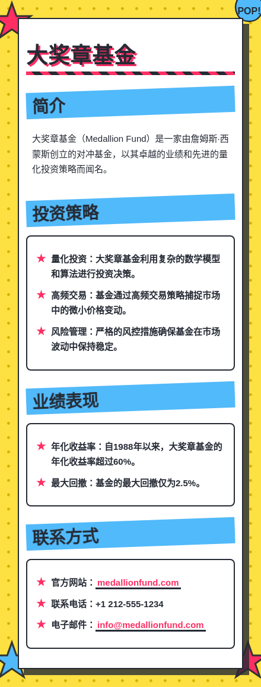

# ManuSphere 的 Hackathon 作品！

## 队伍介绍

来自北大，人大高瓴，北理的大一&大二同学共同开发的 OpenManus tool

为开源，为 AGI，为共同的极客精神！

## 3 天开发成果

### 卡片生成工具 md2card

测试语句：为我生成一张大奖章基金的波普风格卡片，保存在本地

生成结果：



对比过去单纯使用 python_execute 工具生成的卡片：


生成全过程，一共调用 8 次便可以生成精美卡片：


#### 功能特点

- 支持十余种种卡片风格：波普风格、苹果备忘录风格、小红书风格
- 自动下载并保存生成的图片
- 简单易用的命令行和 Web 界面
- 自动根据初始提示词撰写 Markdown 文档
- 支持 Markdown 格式转换为精美卡片

#### ToDo

- 添加更多样式
- 在 Web 前端中允许显示生成卡片

### 精准调用工具执行优化

痛点：生成卡片过程中经常出现调用 Web，试图使用 Canvas 等网站制作卡片的情况

解决方案:添加 tool_guide 工具，根据关键词检索调用最符合工具执行任务

```python
    search_keywords = ["搜索", "查找", "了解", "信息", "寻找", "search", "find", "look up"]
    browser_keywords = ["网站", "网页", "浏览", "访问", "网址", "url", "website", "browser"]
    code_keywords = ["代码", "编程", "运行", "执行", "计算", "code", "program", "execute", "calculate"]
    file_keywords = ["文件", "保存", "读取", "表格", "file", "save", "read", "excel"]
    card_keywords = ["卡片", "生成", "创建", "card", "generate", "create","md2card","图片","图片生成","风格"]
    time_keywords = ["时间", "日期", "年份", "月份", "日历", "农历", "黄历", "calendar", "time", "date", "year", "month", "day"]
    weather_keywords = ["天气", "温度", "湿度", "风力", "风向", "天气预报", "weather", "temperature", "humidity", "wind", "wind direction", "weather forecast"]

    suggested_tools = []

    if any(kw in message.lower() for kw in search_keywords):
        suggested_tools.append("web_search")

    if any(kw in message.lower() for kw in browser_keywords):
        suggested_tools.append("browser_use")

    if any(kw in message.lower() for kw in code_keywords):
        suggested_tools.append("python_execute")

    if any(kw in message.lower() for kw in file_keywords):
        suggested_tools.append("python_execute")

    if any(kw in message.lower() for kw in card_keywords):
        suggested_tools.append("md2card")

    if any(kw in message.lower() for kw in time_keywords):
        suggested_tools.append("calendar")

    if any(kw in message.lower() for kw in weather_keywords):
        suggested_tools.append("weather")

```

### 天气&日期工具

痛点：在使用过程中经常发现调用假日期，假天气，假地点

解决方案：接入专门 API，用于提供精确的日期、天气和地点

代码位置：tool 文件夹中的 time, weather, place 工具

## 感谢

感谢 OpenManus 团队组织本次黑客松，是 OpenManus 的开源才有我们得以发挥的空间

感谢我的两名队友，他们在开发过程中提供了宝贵的建议以及不可或缺的帮助

我们深知技术有限，尚有很大提升空间，但依然希望能尽微薄之力帮助完善 OpenManus

未来会继续优化！希望 OpenManus 越做越好，做真正开源的 Manus！
